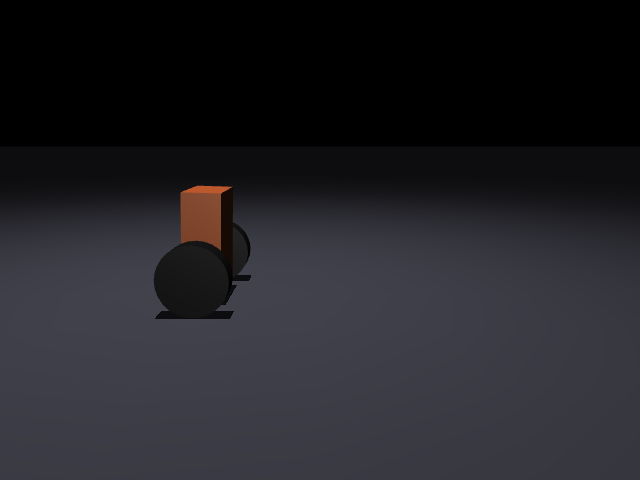

# Mr. Wobbles: a self-balancing two-wheel robot

[](https://github.com/Sammyjroberts/mr-wobbles/actions/workflows/validate.yml)



*MuJoCo sim: the robot settles upright, takes a sideways shove at ~1.5 s, lunges ~27 cm to
catch itself, and drives back to center. Peak tilt during recovery ~3°. The controller is
the LQR designed in this repo, flying on the encoder + IMU signal path; render it yourself
with `scripts/record_gif.py`.*

[](https://youtu.be/HPvMnAkXYeM)

*The real robot.* ▶ <a href="https://youtu.be/HPvMnAkXYeM" target="_blank" rel="noopener noreferrer">Watch on YouTube</a>

An inverted-pendulum robot built from first principles: the controller isn't tuned by
hand on the bench; it's **designed against the real machine**. Physical parameters are
derived from the printed chassis (mass and center of mass pulled straight from the STL)
plus component datasheets, fed into a linearized model, and an optimal (LQR) controller
is solved offline. The same parameters generate the MuJoCo validation plant, so the sim
and the design can never silently disagree.

Python does the physics and control design; the on-robot firmware (Rust + Embassy on an
RP2350 / Pico 2 W) balances the real robot and consumes the gains this repo produces — see
`firmware/`.

---

## The finding that shaped the design

The chassis is a tall, light plate, so intuition says the center of mass is high and the
robot falls slowly. It's the opposite. **Two 100 g gearmotors sit right on the wheel axle**,
and they drag the CoM down hard. Computed from the actual STL and datasheet masses:

| quantity                          | value    |
|-----------------------------------|----------|
| plate mass (from STL, PETG)       | 134 g    |
| pole / body mass                  | 384 g    |
| total mass                        | 494 g    |
| **L, CoM height above the axle**  | **29.3 mm** |

A naive guess put L near 90 mm; this is **~3× shorter**. A low CoM means a short pendulum,
which means a *fast-falling, twitchy* robot that demands a quicker control loop and leaves
less margin. Concrete design takeaway baked into the params: **mount the battery high.**
An 85 g LiPo up top raises L from 29 mm to ~49 mm and makes balancing far more forgiving.
(These numbers regenerate from the STL via `uv run balancer-params`, which also rewrites
`outputs/physical_summary.txt`, so they can't go stale against the printed chassis.)

This is the whole point of deriving parameters instead of guessing them: the hard part of
the problem was invisible until the numbers were real.

---

## How it works

```
robot_params.py   physical truth  →  mass, CoM, and L straight from the STL + datasheets
      │
      ├──────────────► lqr_design.py   linearize (finite-difference A, B) → Riccati → K
      │                                    4 gains for state [x, pitch, ẋ, pitch_rate]
      │
      └──────────────► plant.py        generate the wheels-on-ground MuJoCo contact model
                                           from the *same* params (validation, not design)
                                        │
                             balance.py │  real-time loop: u = −K · state, live viewer
                          evaluate.py   │  one rollout+metrics harness the tests + stats share
```

State reaches the controller the way the real robot will read it: **pitch/pitch-rate from
the IMU, position/velocity derived from the wheel encoders** (`x = wheel_angle · r`, not sim
ground truth, so slip shows up in the loop, as it will on hardware).

Two ideas do the heavy lifting:

- **Single source of truth.** Every physical number comes from `robot_params.py`. The gains
  `K` are solved at startup (never hardcoded) and the validation plant is generated from the
  same params (never a hand-written XML). Both of those were stale-parameter bugs earlier in
  the project; deriving everything from one place made that class of bug impossible.
- **The robot's job is trivial; the design is where the work is.** On hardware the controller
  is a single dot product, `u = −K · state`. All the intelligence lives in the offline
  Riccati solve that produces `K`.

---

## Results (in simulation)

Measured against the wheels-on-ground contact plant (`plant.py`), flying the LQR from
`lqr_design.py` on the encoder + IMU signal path. Every number below regenerates live from
the design via the same harness the CI tests assert on, so the table, the gates, and the
code can't drift apart: `uv run python scripts/report_stats.py`.

| metric                         | value                          | reading |
|--------------------------------|--------------------------------|---------|
| open-loop unstable pole        | \|z\| = **1.049** (> 1)        | it genuinely wants to fall (gravity runaway) |
| closed-loop poles              | \|z\| = 0.72, 0.98, 0.998, 0.998 | all inside the unit circle → **stabilized** |
| pitch recovery (from 3° tilt)  | back within 1° in **~0.07 s**  | the balancing loop is fast and aggressive |
| position re-centering          | within ±10 mm in **~2.3 s**    | slower, soft position loop (by design) |
| disturbance rejection          | **2.2 N** shove → peak tilt **3.0°**, lunge ~27 cm | catches it and recovers |
| peak control effort            | **0.04 N·m** of 0.31 N·m stall | ~**88 % torque headroom** at ideal sensors |
| encoder vs. true position      | tracks within **~2 mm** while balancing | the sim-to-real signal path is faithful |

**The interesting finding: latency, not noise, is the enemy.** Sweeping to pessimistic
hardware (0.02 rad/s gyro noise + 4 ms control latency + PWM deadband), the *same* 2.2 N shove
drives peak tilt to **~19°** and momentarily **saturates the motors**, and isolating the knobs
shows it's almost entirely the **4 ms of loop latency**, not the noise. That's the low-CoM
finding cashing out: the pendulum is twitchy (fastest closed-loop mode ~6 ms), so a fast,
low-latency control loop is a **hard Phase-2 firmware requirement**, not a nicety. It still
recovers, but the ideal-sensor headroom is spent closing that gap.

**Phase-1 acceptance criterion.** With the IMU-only gains (no encoders, position feedback
zeroed) it balances but **drifts ~28 cm over 9 s**: quantified wander, not a bug. That's the
number to check the real robot against during Phase-1 bring-up: if it wanders faster than sim
predicts, something else is wrong.

The GIF up top is the ideal-sensor case: the 2.2 N shove and recovery.

---

## Quickstart

Uses [uv](https://docs.astral.sh/uv/).

```bash
uv sync                 # create the env + install deps

uv run balancer-params  # print physical numbers (mass, CoM, L); rewrite physical_summary.txt
uv run balancer-design  # solve LQR → gains K → outputs/Kc_real.npy, Kc_phase1.npy
uv run balancer-sim     # live balancing simulation (MuJoCo viewer)

uv run python scripts/report_stats.py   # the Results numbers, live from the design
uv run --group dev pytest               # the CI design gates (see below)
```

The console scripts are thin wrappers around `python -m balancer.sim.balance`, etc.

---

## Layout

```
src/balancer/
  params/robot_params.py   physical truth: mass/CoM/L from the STL + datasheet masses
  sim/lqr_design.py        linearize → LQR → K; mask_phase1() for the IMU-only gains
  sim/balance.py           real-time controller + viewer (u = −K · state); encoder state, PHASE switch
  sim/plant.py             wheels-on-ground contact model, generated from params
  sim/evaluate.py          one rollout + metrics harness (report_stats and tests both call it)
  paths.py                 resolves repo data dirs (cad/, outputs/)
tests/test_design.py       CI gates: stable, torque headroom, golden gains, encoder tracks truth
.github/workflows/         validate.yml, runs the gates on every push/PR
cad/balancer_chassis_v2.stl   printable chassis plate (PETG, prints flat)
cad/gen_chassis.py            parametric generator for the plate
hardware/wiring_phase1.svg    Phase-1 wiring (balance on IMU, no encoders)
hardware/chassis_drawing.svg  dimensioned plate drawing
scripts/record_gif.py         renders assets/balance.gif from the sim
scripts/report_stats.py       prints the Results numbers, live from the design
outputs/                      Kc_real.npy (Phase 2), Kc_phase1.npy (Phase 1), physical_summary.txt
```

---

## Hardware roadmap

- **Phase 1 (IMU only):** Pico (USB) + TB6612 driver + 2 gearmotors + IMU (STEMMA QT).
  Balances on the IMU alone (gains in `outputs/Kc_phase1.npy`), so it drifts/wanders, with no
  position feedback. Simplest wiring, no level shifter. See `hardware/wiring_phase1.svg`.
- **Phase 2 (encoders):** wheel encoders for position hold, the validated flight config
  (`outputs/Kc_real.npy`, full-state feedback). Encoders run at 5 V and exceed the Pico's
  3.3 V limit, so this phase needs a **logic level shifter** (BSS138).
- **Firmware:** on-robot control loop in **Rust + Embassy** on the RP2350 (Pico 2 W): async
  tasks with a fixed-interval `Ticker` (500 Hz), I²C to the IMU, PWM + direction GPIO to the
  TB6612, and a hardware watchdog for crash recovery. Reads the gains `K` produced by
  `balancer-design`. Built and running — see `firmware/`.

**Build status:** assembled and **self-balancing on real hardware** (Phase 1, IMU-only) — see
the clip up top. Also validated in sim (the Phase-2 encoder path is the default and is
CI-gated). Next up: wheel encoders for Phase-2 position hold (`outputs/Kc_real.npy`).

---

## Notes

- `M_WHEEL` and `M_ELECTRONICS` in `robot_params.py` are estimates; refine if you weigh the
  parts. The motors and plate dominate the CoM and are both known precisely.
- `plant.py`'s pole inertia is lumped/approximate (mass and CoM height are exact; wheel spin
  inertia *is* modeled from the cylinder geoms); swap in a distributed pole inertia for tighter
  validation.
- `CONTROL_SIGN` / `ENC_SIGN` in `balance.py`: flip `CONTROL_SIGN` if the motors drive *into*
  the fall; `ENC_SIGN` sets which wheel-rotation direction is forward (pinned by
  `test_encoder_tracks_truth`). The usual first-run sign gotchas.
- The Results numbers are the encoder-path, ideal-sensor case. Real hardware lives closer to
  the realistic sweep, so budget for the latency finding.

MIT licensed.
